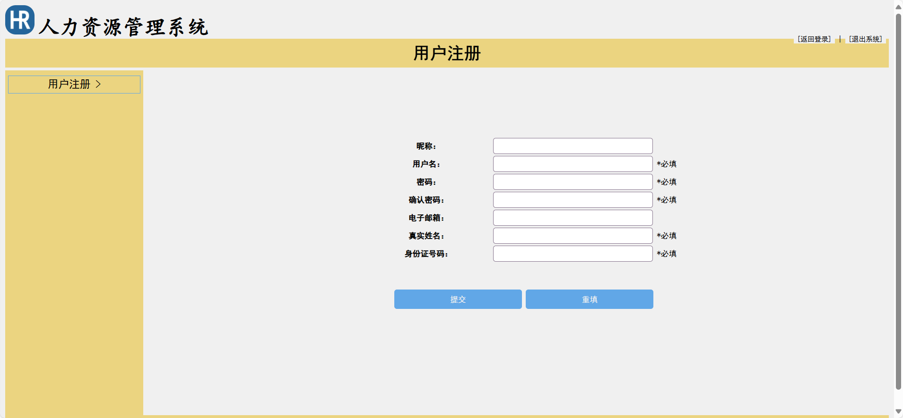

# 简单人力资源管理系统(文末免费领取☟)
> 
#### 介绍
简单人力资源管理系统(Java_Servlet_JSP)
有BUG可留言加微

#### 软件架构
Java + Servlet + JSP + Mysql

#### 项目功能说明

> + 个人信息修改
> + 部门管理
> + 员工管理
> + 培训管理
> + 奖惩管理
> + 薪资管理
> + 系统管理

### 部分功能演示

### 环境需求(可免费提供)
- idea/eclipse、jdk-1.8、maven-3.8.6、mysql、node.js等

## 有项目修改、安装调试需求 请联系以下

## 获取资源扫☝☝☝

